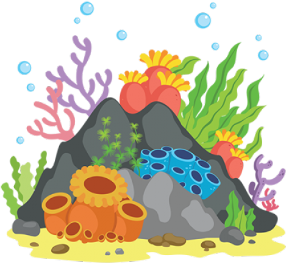
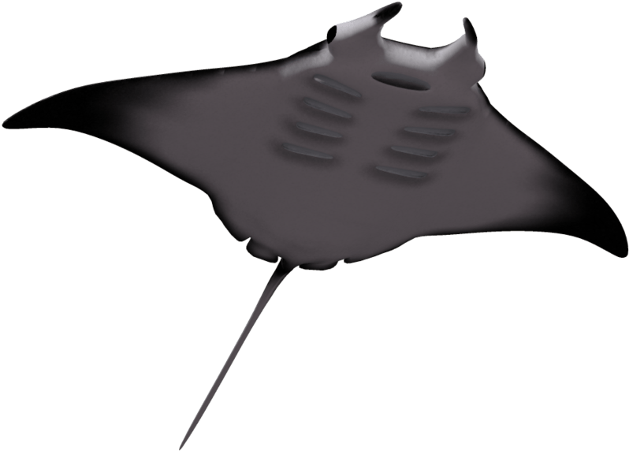

<!-- README.md is generated from README.Rmd. Please edit that file -->

```{r, include = FALSE}
knitr::opts_chunk$set(
  collapse = TRUE,
  comment = "#>",
  fig.path = "man/figures/README-",
  out.width = "100%"
)
```

# Utilities.Package 

Primarily, Utilities.Package is a package of simple utility features for data manipulation and simple statistics. It also contains personalisable palettes and themes for ggplot2 plots. 

## Installation 

You can install the development version of Utilities.Package from [Github](https://https://github.com) with:

``` r
install.packages("devtools")

devtools::install_github("bedeffinian/Utilities.Package")
```


## Features

Before showing the features we need to gather some data to be able to look at the functions of the package. To do this we will first of all load some packages (all available from [CRAN](https://CRAN.R-project.org) apart from Utilities.Package).

### Data Creation

```{r example packages we will use,warning=FALSE,message=FALSE}
library(marmap)
library(tidyverse)
library(sf)
library(lme4)
library(Utilities.Package)
library(mapdata)
library(maps)
library(palmerpenguins)
library(patchwork)
```

Once the packages are loaded we can then start getting our data ready for the examples. For some example data we will grab the Palmer Penguins data then also get some bathymetry data from the marmap package that extracts bathymetry from the NOAA databases. 

```{r data creation ,warning=FALSE,message=FALSE,cache=TRUE}
# get palmer penguins df
data(package = 'palmerpenguins')


df<-penguins

# get bathymetry data

b <- getNOAA.bathy(lon1 = 160, lon2 = 180, lat1 = -28.5, lat2 = -49.2,
                  resolution = 5)

# convert bathymetry matrix to spatial object

B <- as.SpatialGridDataFrame(b)

# convert spatial object to special features

sf_bathy <- st_as_sf(B) %>%
  dplyr::filter(layer<0.1)

# get land outline 

nz <- map_data("nz")

```

### Simple data cleaning

However, brilliant your data are there will often be NA values. Sometimes this is fine but specific columns may be used for analysis later and inclusion of NA's might therefore be a nuisance. We can use the *completeFun()*, where we define the dataframe to use and then the column/s we want to check to remove rows if they contain NAs.   

```{r}
head(df)

# remove rows where sex is NA 

df2<-Utilities.Package::completeFun(df,"sex")

head(df2)

```


Often we use regression models to assess data. If we want to check the assumptions of these models the base r functions suck. There are good packages to check these assumptions () but we also have another here. 

```{r model check,fig.width=15}
mod1<-lm(body_mass_g~.,data=df2)

Utilities.Package::Model_Check(mod1)

```

## Data Visualisation

In Utilities.Package we have many functions to make figures look nicer (*we think*). Lets do a basic plot.

```{r base plot,fig.width=15}

ggplot(data = df2, aes(x = flipper_length_mm, y = body_mass_g)) +
  geom_point(aes(color = species),
             size = 1)+
  geom_smooth(aes(color=species),method = "lm")+
  labs(x="Flipper Length (mm)",
       y="Body Mass (g)",
       color="Species")
  
```

Now lets make the theme look better. 

```{r theme use,fig.width=15}

ggplot(data = df2, aes(x = flipper_length_mm, y = body_mass_g)) +
  geom_point(aes(color = species),
             size = 1)+
  geom_smooth(aes(color=species),method = "lm")+
  labs(x="Flipper Length (mm)",
       y="Body Mass (g)",
       color="Species")+
  Utilities.Package::theme_Bede()

```

Okay that is better but lets make the colours nicer. 

```{r colour use,message=FALSE,fig.width=12}

colourplot1<-ggplot(data = df2, aes(x = flipper_length_mm, y = body_mass_g)) +
  geom_point(aes(color = species),
             size = 1)+
  geom_smooth(aes(color=species),method = "lm")+
  labs(x="Flipper Length (mm)",
       y="Body Mass (g)",
       color="main",
       title="Main Palette")+
  Utilities.Package::theme_Bede()+
  Utilities.Package::scale_colour_Bede("main")

colourplot2<-ggplot(data = df2, aes(x = flipper_length_mm, y = body_mass_g)) +
  geom_point(aes(color = species),
             size = 1)+
  geom_smooth(aes(color=species),method = "lm")+
  labs(x="Flipper Length (mm)",
       y="Body Mass (g)",
       color="mixed",
       title="Mixed Palette")+
  Utilities.Package::theme_Bede()+
  Utilities.Package::scale_colour_Bede("mixed")

colourplot3<-ggplot(data = df2, aes(x = flipper_length_mm, y = body_mass_g)) +
  geom_point(aes(color = species),
             size = 1)+
  geom_smooth(aes(color=species),method = "lm")+
  labs(x="Flipper Length (mm)",
       y="Body Mass (g)",
       color="cool",
       title="Cool Palette")+
  Utilities.Package::theme_Bede()+
  Utilities.Package::scale_colour_Bede("cool")

colourplot4<-ggplot(data = df2, aes(x = flipper_length_mm, y = body_mass_g)) +
  geom_point(aes(color = species),
             size = 1)+
  geom_smooth(aes(color=species),method = "lm")+
  labs(x="Flipper Length (mm)",
       y="Body Mass (g)",
       color="hot",
       title="Hot Palette")+
  Utilities.Package::theme_Bede()+
  Utilities.Package::scale_colour_Bede("hot")

colourplot5<-ggplot(data = df2, aes(x = flipper_length_mm, y = body_mass_g)) +
  geom_point(aes(color = species),
             size = 1)+
  geom_smooth(aes(color=species),method = "lm")+
  labs(x="Flipper Length (mm)",
       y="Body Mass (g)",
       color="PhD Bede",
       title="PhD Palette")+
  Utilities.Package::theme_Bede()+
  Utilities.Package::scale_colour_Bede("PhD")

colourplot6<-ggplot(data = df2, aes(x = flipper_length_mm, y = body_mass_g)) +
  geom_point(aes(color = species),
             size = 1)+
  geom_smooth(aes(color=species),method = "lm")+
  labs(x="Flipper Length (mm)",
       y="Body Mass (g)",
       color="Orkney Bede",
       title="Orkney Palette")+
  Utilities.Package::theme_Bede()+
  Utilities.Package::scale_colour_Bede("Orkney")

colourplot7<-ggplot(data = df2, aes(x = flipper_length_mm, y = body_mass_g)) +
  geom_point(aes(color = species),
             size = 1)+
  geom_smooth(aes(color=species),method = "lm")+
  labs(x="Flipper Length (mm)",
       y="Body Mass (g)",
       color="SAS Bede",
       title="SAS Palette")+
  Utilities.Package::theme_Bede()+
  Utilities.Package::scale_colour_Bede("SAS")

colourplot8<-ggplot(data = df2, aes(x = flipper_length_mm, y = body_mass_g)) +
  geom_point(aes(color = species),
             size = 1)+
  geom_smooth(aes(color=species),method = "lm")+
  labs(x="Flipper Length (mm)",
       y="Body Mass (g)",
       color="AnnePort Bede",
       title="AnnePort Palette")+
  Utilities.Package::theme_Bede()+
  Utilities.Package::scale_colour_Bede("AnnePort")

colourplot9<-ggplot(data = df2, aes(x = flipper_length_mm, y = body_mass_g)) +
  geom_point(aes(color = species),
             size = 1)+
  geom_smooth(aes(color=species),method = "lm")+
  labs(x="Flipper Length (mm)",
       y="Body Mass (g)",
       color="BathyBlues Bede",
       title="BathyBlues Palette")+
  Utilities.Package::theme_Bede()+
  Utilities.Package::scale_colour_Bede("Bathy_Blues")

colourplot1+colourplot2+
  colourplot3+colourplot4+
  colourplot5+colourplot6+
  colourplot7+colourplot8 +
  colourplot9 &
  theme(legend.position = c(0.15,0.7))


```

There also a few colours palettes for gradients by putting discrete=FALSE.

```{r mapping,fig.width=20,fig.height=20}

map1<-ggplot()+
  geom_sf(data=sf_bathy,mapping=aes(colour=layer))+
  geom_polygon(data = nz, aes(x = long, y = lat, group = group),
               fill = "forestgreen", colour = "black",alpha=0.4)+
  Utilities.Package::scale_colour_Bede(name="Depth (m) Bathy_Blues Pallette",'Bathy_Blues',
                            discrete=FALSE,reverse=TRUE)+
  Utilities.Package::theme_Bede()+
  labs(x="Longitude",
       y="Latitude")

map2<-ggplot()+
  geom_sf(data=sf_bathy,mapping=aes(colour=layer))+
  geom_polygon(data = nz, aes(x = long, y = lat, group = group),
               fill = "forestgreen", colour = "black",alpha=0.4)+
  Utilities.Package::scale_colour_Bede(name="Depth (m) Mixed Pallette",'mixed',discrete=FALSE)+
  Utilities.Package::theme_Bede()+
  labs(x="Longitude",
       y="Latitude")

map3<-ggplot()+
  geom_sf(data=sf_bathy,mapping=aes(colour=layer))+
  geom_polygon(data = nz, aes(x = long, y = lat, group = group),
               fill = "forestgreen", colour = "black",alpha=0.4)+
  Utilities.Package::scale_colour_Bede(name="Depth (m) PhD Pallette",'PhD',discrete=FALSE)+
  Utilities.Package::theme_Bede()+
  labs(x="Longitude",
       y="Latitude")

map4<-ggplot()+
  geom_sf(data=sf_bathy,mapping=aes(colour=layer))+
  geom_polygon(data = nz, aes(x = long, y = lat, group = group),
               fill = "forestgreen", colour = "black",alpha=0.4)+
  Utilities.Package::scale_colour_Bede(name="Depth (m) Main Pallette",'main',discrete=FALSE)+
  Utilities.Package::theme_Bede()+
  labs(x="Longitude",
       y="Latitude")

map5<-ggplot()+
  geom_sf(data=sf_bathy,mapping=aes(colour=layer))+
  geom_polygon(data = nz, aes(x = long, y = lat, group = group),
               fill = "forestgreen", colour = "black",alpha=0.4)+
  Utilities.Package::scale_colour_Bede(name="Depth (m) SAS Pallette",'SAS',discrete=FALSE)+
  Utilities.Package::theme_Bede()+
  labs(x="Longitude",
       y="Latitude")

map6<-ggplot()+
  geom_sf(data=sf_bathy,mapping=aes(colour=layer))+
  geom_polygon(data = nz, aes(x = long, y = lat, group = group),
               fill = "forestgreen", colour = "black",alpha=0.4)+
  Utilities.Package::scale_colour_Bede(name="Depth (m) AnnePort Pallette",'AnnePort',discrete=FALSE)+
  Utilities.Package::theme_Bede()+
  labs(x="Longitude",
       y="Latitude")

(map1+map2)/(map3+map4)/(map5+map6)

```

## Fin. 
